ZER0 Tickets
===================

ZER0 Tickets é um simples sistema para controle de tickets de suporte.

Suas funcionalidades incluem:

- Abertura de tickets
- Visualização dos Tickets
  - Abertos
  - Fechados
  - Abertos pelo usuário logado
  - Sob responsabilidade do usuário logado
- Gestão de usuários com os seguintes níveis de acesso:
  - Usuário
  - Suporte
  - Administrador
- Categorização dos tickets

Telas do Sistema
---

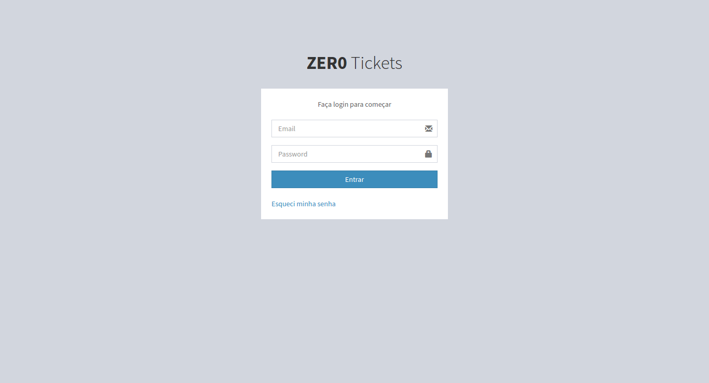

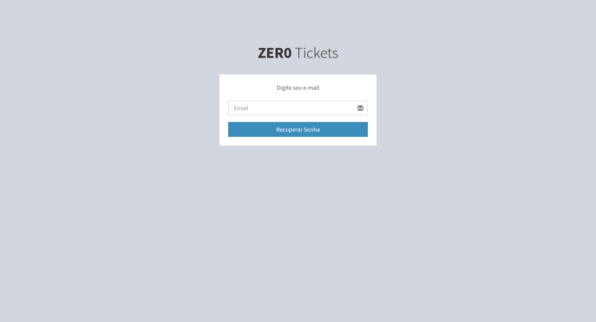

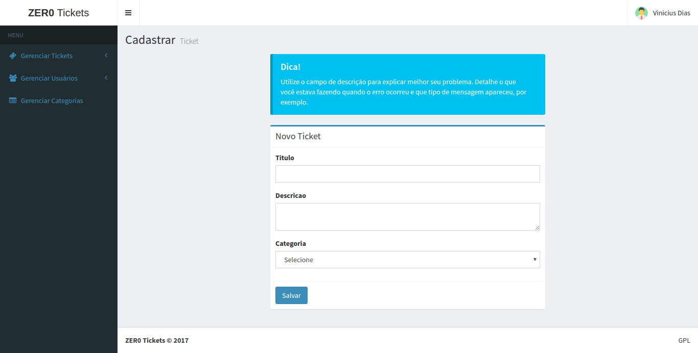

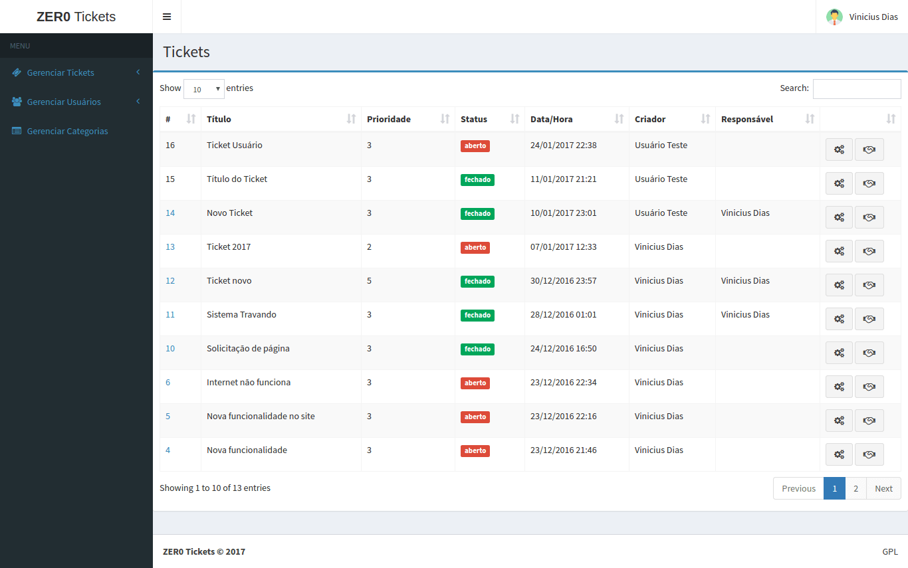

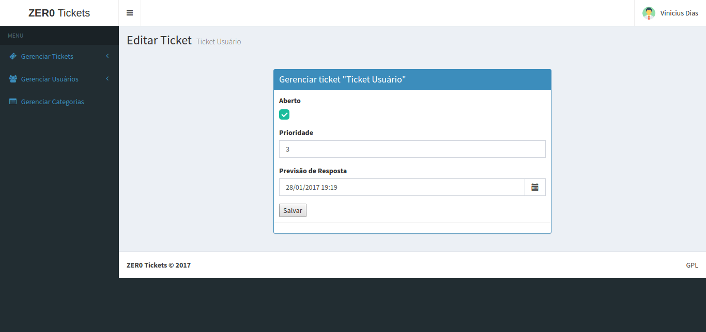

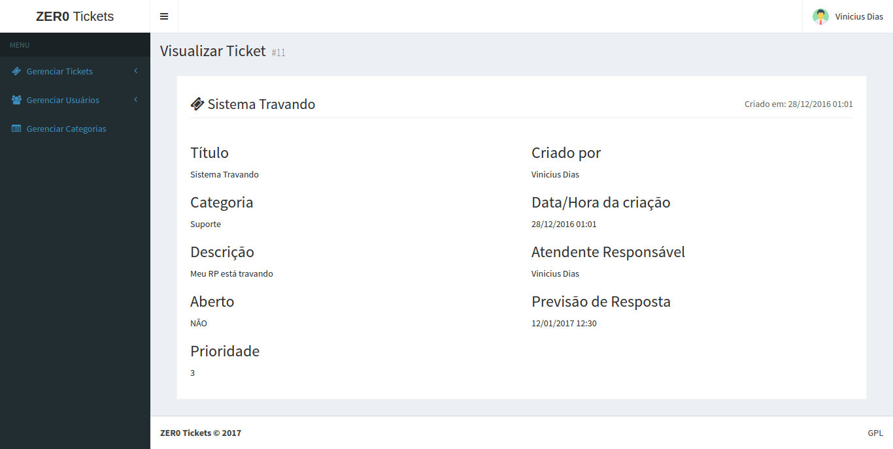

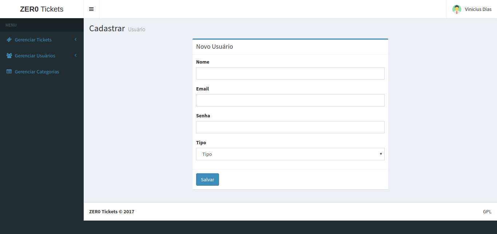

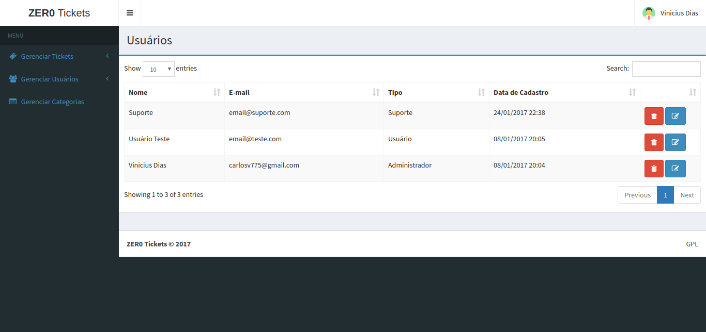

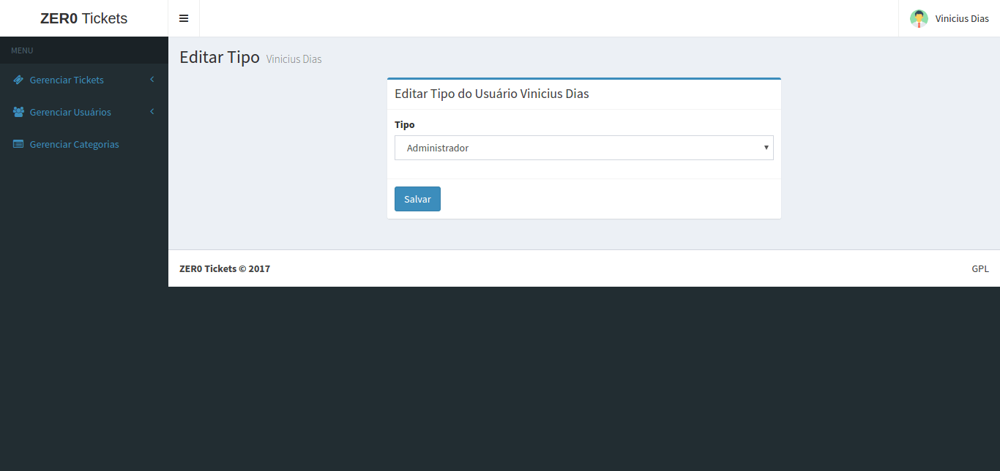

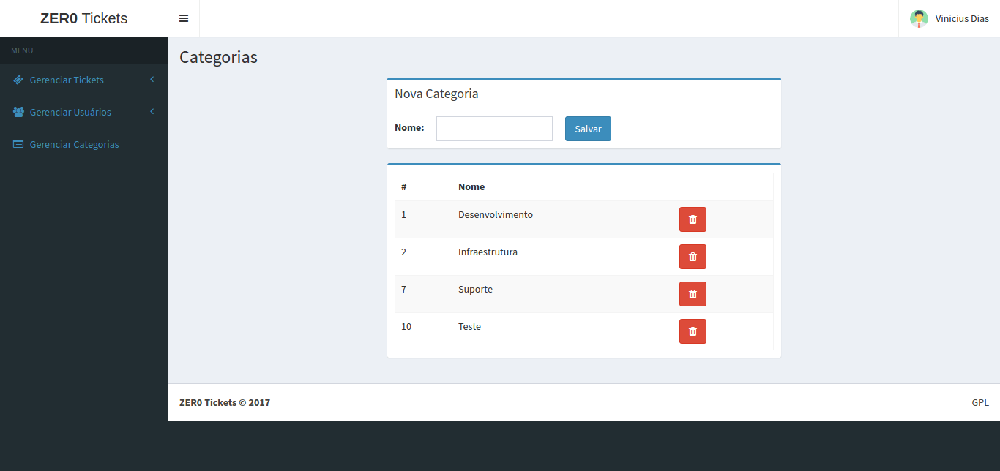

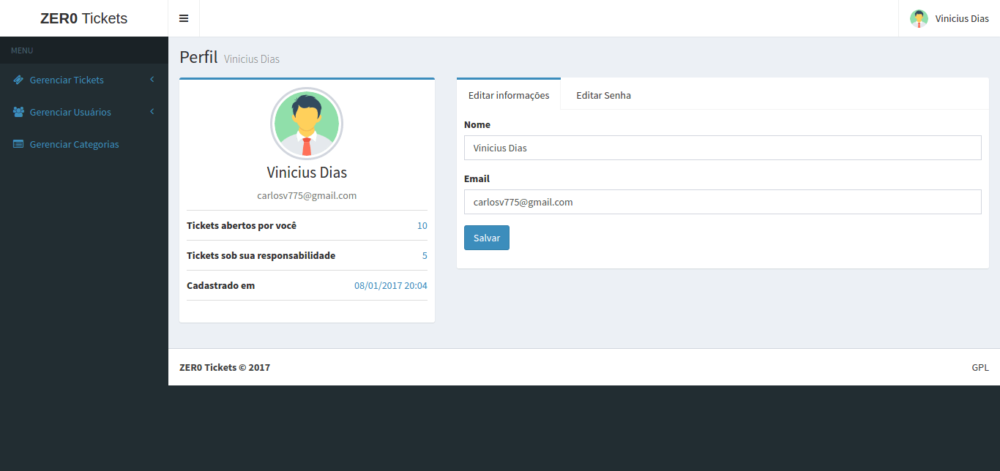

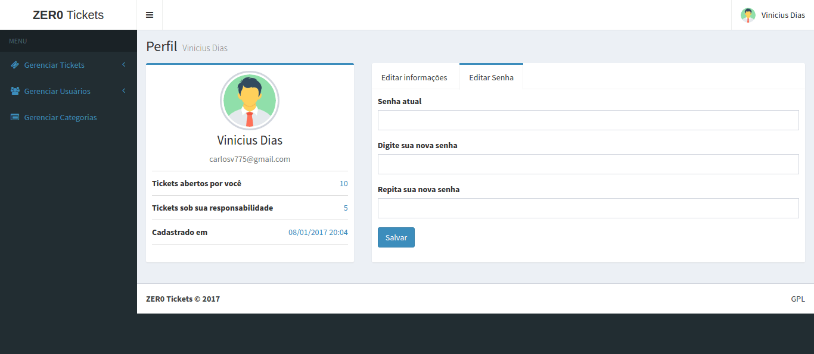